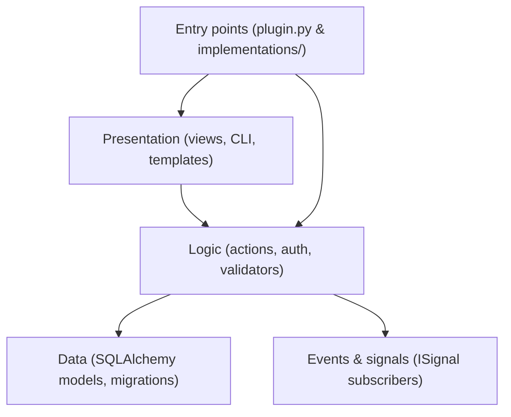

# Development Overview

Developing a CKAN extension requires organizing code into clean, decoupled
architectural layers. Rather than building features inside monolithic files or
mixing business logic into web views, modern CKAN extension development follows
strict separation of responsibilities.

This guide outlines the overall extension architecture and the step-by-step
process for developing new features.

---

## Architectural Layers

Every feature in a CKAN extension is partitioned across predictable layers:

* **Entry point**: Subclasses `ckan.plugins.SingletonPlugin` to register
  capabilities with [CKAN's interface system](defining-plugins.md).
* **Logic**: Encapsulates core domain operations in
  [actions](adding-actions.md), enforces input [validation](validators.md), and
  guards access via [auth functions](adding-actions/#auth-functions).
* **Data**: Manages persistent state using SQLAlchemy [database
  models](database-models.md) and version-controlled [database
  migrations](database-migrations.md).
* **Presentation**: Exposes HTTP routes via [flask
  blueprints](adding-views.md), administration tasks via [CLI
  commands](cli-commands.md), and UI utilities via [template
  helpers](template-helpers.md).
* **Cross-cutting layer**: Broadcasters and listeners decoupled via
  [signals](signals.md), runtime options managed via [config
  management](config-management.md), and static safety enforced with
  [typing](typing.md).

---

## The Feature Development Process

When building a new feature or extending existing CKAN capabilities, follow
this standard workflow:

1. Data modeling & persistence

    If the feature introduces new data entities or persistent state beyond core CKAN schemas:

    * Declare [SQLAlchemy models](database-models.md).
    * Generate [a migration](database-migrations.md) script to handle schema
      creation and updates.

2. Business logic & action design

    Write pure, reusable business logic in the logic layer:

    * Define [action functions](adding-actions.md) inside `logic/action/` named with your extension
      prefix (e.g. `myext_item_create`).
    * Annotate actions with `@tk.validate_action_data(schema)` to enforce strict
      [schema verification](validators.md).
    * Always call `tk.check_access()` inside action functions to enforce
      authorization checks.

3. Plugin registration

    Register entry points and hooks cleanly:

    * Use `@tk.blanket` decorators on your [plugin class](defining-plugins.md) in `plugin.py` to
      auto-discover actions, auth functions, validators, blueprints, and template
      helpers.
    * Extract complex CKAN interface implementation methods (e.g. `IConfigurer`,
      `IPackageController`) into an `implementations/` submodule rather than
      cluttering `plugin.py`.

4. Presentation & user interfaces

    Expose your business actions to users:

    * Create [flask blueprints](adding-views.md) inside `views/` for HTTP web routes.
    * Register [CLI commands](cli-commands.md) inside `cli.py` for administrative or background operations.
    * Expose [custom Jinja functions](template-helpers.md) in `helpers.py` for UI presentation needs.
    * **Rule**: Views and CLI commands must remain thin wrappers—they extract
      parameters and invoke `tk.get_action()`, never executing business logic or
      raw database queries directly.

5. Event decoupling & config integration

    Complete the feature integration:

    * Declare custom extension [parameters](config-management.md) in
      `config_declaration.py` with fallback defaults.
    * Use `ISignal` to broadcast or react to system [events](signals.md) without tight coupling.
    * Annotate interface implementations with `@override` and [type
      hints](typing.md) to maintain strict safety.

---

## Section Map

For detailed syntax, code patterns, and implementation examples, refer to the individual development guides:

* [Defining Plugins](defining-plugins.md) — Plugin structure, blanket discovery, and interface implementation setup.
* [Adding Actions](adding-actions.md) — Writing actions, calling conventions, and context handling.
* [Validators](validators.md) — Schema validation rules, custom validators, and `@tk.validate_action_data`.
* [Adding Views](adding-views.md) — Flask Blueprints, route definitions, and request handling.
* [CLI Commands](cli-commands.md) — Click CLI command groups and terminal tools.
* [Config Management](config-management.md) — Declaration files, config options, and runtime retrieval.
* [Database Models](database-models.md) — SQLAlchemy v2 model definitions, session management, and dictize serialization.
* [Database Migrations](database-migrations.md) — Isolated Alembic migrations for extension tables.
* [Signals](signals.md) — Event handling with `ISignal` interfaces.
* [Template Helpers](template-helpers.md) — Exposing python helper functions to Jinja2 templates.
* [Typing](typing.md) — Type hints, `@override` annotations, and static checking.
