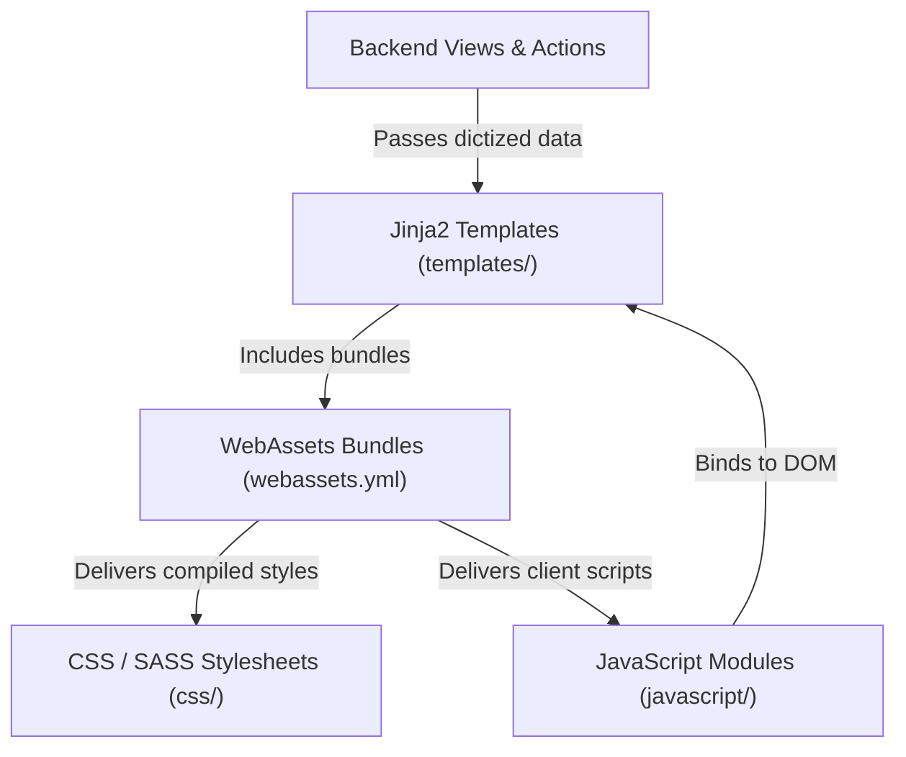

# Frontend Overview

The CKAN frontend is a modular, server-rendered architecture designed for high performance, accessibility, and clean extension customization. Extensions customize page layouts, introduce client-side interactivity, and manage custom styling through structured frontend layers.

This guide provides an overview of the frontend architecture, asset pipeline, and development process.

---

## Core Frontend Layers

Frontend development in a CKAN extension is partitioned into four sub-domains:



* **Templating & Markup**: Jinja2 templates define HTML layout structures,
  extend core CKAN pages, and render reusable template snippets
  ([Templates](templates.md)).
* **Asset Bundling**: WebAssets manifests bundle, minify, and register CSS/JS
  assets ([Assets](assets.md)). Public files must be declared within asset
  bundles in `webassets.yml` rather than served directly as loose static files.
* **Client-Side Interactivity**: Scoped JavaScript modules or TypeScript
  components handle dynamic client behaviors using CKAN's `ckan.module`
  framework ([JavaScript](javascript.md)).
* **Styling & Design**: Custom SASS/CSS stylesheets define component aesthetics
  and responsive layout rules ([CSS & Styling](css.md)).

---

## Frontend Data Flow & Workflow

When developing frontend features in a CKAN extension, follow this execution flow:

### 1. View & Context Preparation
Flask views invoke `get_action()` to retrieve dictized data from the logic layer and pass it to the rendering engine ([Adding Views](../development/adding-views.md)).

### 2. Template Rendering
Jinja2 templates extend base CKAN templates using `` and output structured HTML ([Templates](templates.md)).

* For complex data formatting, invoke registered backend helpers using `h.myext_format_data()` ([Template Helpers](../development/template-helpers.md)).
* Keep templates focused strictly on presentation markup—avoid embedding business logic inside Jinja templates.

### 3. Asset Loading via WebAssets
Templates load asset bundles by referencing registered asset library names ([Assets](assets.md)):
```html

```

* Asset bundles specified in `webassets.yml` automatically concatenate scripts,
  and produce minified production files when configured properly.

### 4. DOM Initialization via JS Modules
Client-side interactivity is bound directly to HTML elements using data attributes ([JavaScript](javascript.md)):
```html
<div data-module="myextension-item-card" data-module-id="123">
    <!-- Component markup -->
</div>
```
CKAN's module loader automatically instantiates the corresponding JavaScript module when the element enters the DOM.

---

## Core Frontend Rules

1. **Mandatory WebAssets Bundling**: All JavaScript scripts and CSS stylesheets must be declared within `webassets.yml` bundles and registered via `IConfigurer` / `add_resource`. Raw, loose public files cannot be included without bundle declarations.
2. **Modular Client Logic**: Never write inline `<script>` tags or pollute the global `window` scope. Wrap all client-side logic inside isolated `ckan.module` components.
3. **Template Inheritance**: Extend core CKAN templates via `` and override specific `` sections to remain compatible across CKAN releases.

---

## Section Map

For complete code examples, configuration syntax, and implementation guides, refer to individual frontend pages:

* [Templates](templates.md) — Jinja2 template inheritance, snippet structures, and template directory setup.
* [Assets](assets.md) — WebAssets configuration, `webassets.yml` syntax, and bundle registration.
* [JavaScript](javascript.md) — Creating `ckan.module` components, event handling, and TypeScript integration.
* [CSS & Styling](css.md) — SASS/CSS modular styling, asset inclusion, and theme customization.
