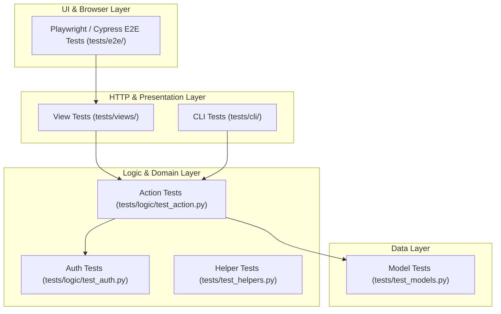

# Testing Overview

A well-tested CKAN extension relies on a structured, domain-driven testing architecture. Rather than writing monolithic end-to-end tests that attempt to verify an entire feature in one file, tests must be divided by domain and placed in their expected, predictable location.

This guide outlines the testing strategy, layer separation rules, and overall workflow for extension testing.

---

## Domain-Driven Test Placement

Every test in your extension has an expected place based on the layer of the application it targets. Testing layers independently ensures fast execution, precise failure diagnosis, and maintainable test suites.



### Where Tests Belong

| Application Layer        | Test Location                | Responsibility                                                                             | Guide                                                               |
|:-------------------------|:-----------------------------|:-------------------------------------------------------------------------------------------|:--------------------------------------------------------------------|
| **API & Business Logic** | `tests/logic/test_action.py` | Validates Action data schemas, business rules, return values, and side effects.            | [Action Tests](actions.md)                                          |
| **Authorization**        | `tests/logic/test_auth.py`   | Validates access control rules, user permissions, and anonymous access restrictions.       | [Auth Function Tests](auth-functions.md)                            |
| **Database & Models**    | `tests/test_models.py`       | Validates SQLAlchemy v2 schemas, DB constraints, table queries, and model methods.         | [Model Tests](models.md)                                            |
| **HTTP & Views**         | `tests/views/`               | Validates Flask route mapping, HTTP status codes, headers, and redirects via `app` client. | [View Tests](views.md)                                              |
| **CLI Commands**         | `tests/cli/`                 | Validates Click command execution, arguments, and terminal stdout output.                  | [CLI Tests](cli.md)                                                 |
| **Helpers & Utilities**  | `tests/test_helpers.py`      | Validates Jinja2 template helpers and isolated utility functions in pure isolation.        | [Helper Tests](helpers.md) & [Unit Tests](unit-tests.md)            |
| **UI & E2E Workflows**   | `tests/e2e/`                 | Validates full browser interactions, DOM updates, and complex visual workflows.            | [Playwright E2E](e2e-playwright.md) & [Cypress E2E](e2e-cypress.md) |

---

## Why Layered Testing Matters

Dividing tests by domain delivers key engineering benefits:

1. **Fast Execution Loops**: Action and model tests execute in milliseconds using direct Python calls. Reserving browser automation strictly for E2E tests keeps your continuous integration suite fast.
2. **Immediate Failure Diagnostics**: When a database constraint fails, `test_models.py` pinpoints the exact table issue immediately—eliminating the need to debug vague UI element timeouts.
3. **Decoupled Refactoring**: You can redesign template HTML or update Flask routes without breaking Action logic tests, provided the underlying Action API contract remains unchanged.

---

## The Testing Process

When adding a feature or refactoring code, follow this testing progression:

```
[1. Database Models] ➔ [2. Actions & Auth] ➔ [3. Views & CLI] ➔ [4. E2E Journeys]
```

1. **Test Data Persistence**: Write model tests for custom database entities and methods ([Model Tests](models.md)).
2. **Test Core Logic**: Write Pytest functions verifying Action execution and Auth rules ([Action Tests](actions.md) and [Auth Function Tests](auth-functions.md)).
3. **Test Presentation Endpoints**: Verify HTTP responses and status codes via Flask test client ([View Tests](views.md) and [CLI Tests](cli.md)).
4. **Test Critical User Journeys**: Use Playwright or Cypress strictly for interactive browser flows that require real DOM or JavaScript execution ([Playwright E2E](e2e-playwright.md)).
5. **Leverage Shared Infrastructure**: Use Pytest [Fixtures](fixtures.md) (`clean_db`, `ckan_config`, `app`) and [Test Factories](test-factories.md) (`sysadmin`, `user`, `package`) to prepare clean state before each test.

---

## Section Map

Refer to individual testing guides for detailed code examples, Pytest fixture usage, and implementation details:

* [Fixtures](fixtures.md) — Built-in CKAN Pytest fixtures (`clean_db`, `ckan_config`, `app`, etc.).
* [Test Factories](test-factories.md) — Factory Boy definitions for generating test users, datasets, and organizations.
* [Unit Tests](unit-tests.md) — Unit testing principles, directory structure, and Pytest configuration.
* [Action Tests](actions.md) — Testing action logic, validation schemas, and error handling.
* [Auth Function Tests](auth-functions.md) — Testing authorization logic, sysadmin bypasses, and anonymous rules.
* [View Tests](views.md) — Testing Flask Blueprints, web routes, and HTTP response codes.
* [CLI Tests](cli.md) — Testing Click CLI command invocation and output parsing.
* [Helper Tests](helpers.md) — Testing custom Jinja2 template helpers.
* [Model Tests](models.md) — Testing database models, SQLAlchemy queries, and Alembic migrations.
* [Playwright E2E](e2e-playwright.md) — End-to-end browser automation testing using Playwright.
* [Cypress E2E](e2e-cypress.md) — End-to-end integration testing using Cypress.
